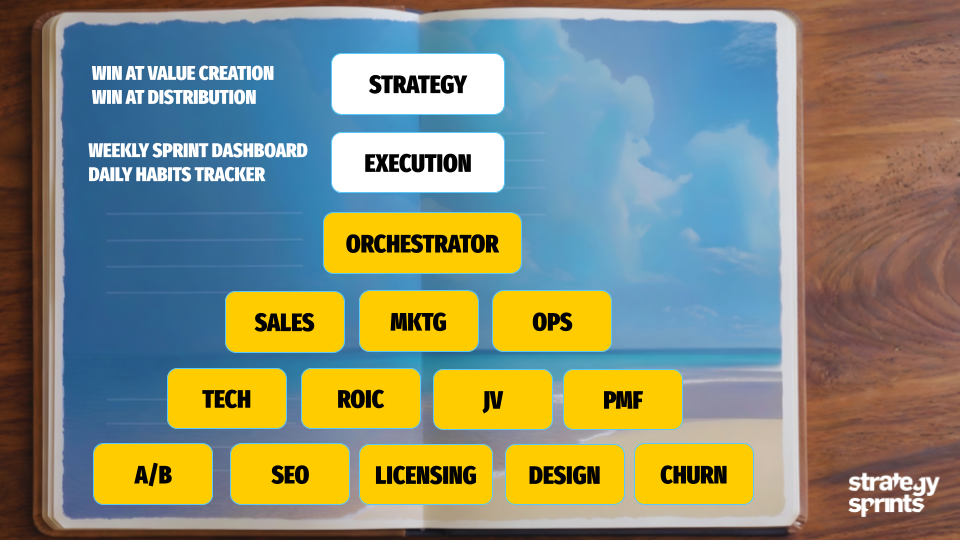

# Jay .. The $21B Growth Playbook, Running in Your Terminal

Most founders optimize one thing at a time. Jay runs 8 revenue growth frameworks against your business data every morning and tells you the single highest-ROI move to make this week.

Built on Jay Abraham's methodology. Adapted for Claude Code.



## What Happens When You Run It

```
Jay Strategic Alliances -- 2026-04-09

THE ONE THING: Activate Sylvia's iHeartRadio exec intro
  -- $108K/year candidate. 1 email, 1 intro call.
  -- Expected ROI: $108K if closed, $0 cost.

CROSS-INDUSTRY MOVE: Churn at 5%/month
  -- Duolingo solved this with streak mechanics (+14% retention)
  -- Your version: weekly wins streak in community
  -- Effort: 2 hours | Impact: 5-10% retention lift

Partnerships: 12 active | 3 stale | 2 new this week
```

This is real output from Strategy Sprints, where Jay runs daily alongside 14 other AI advisors managing sales, strategy, distribution, health, and investing.

## The 8 Frameworks

Every run applies these to YOUR data:

| # | Framework | The Question It Answers |
|---|-----------|------------------------|
| 1 | **Hidden Assets** | What are you sitting on that you haven't monetized? |
| 2 | **Strategy of Preeminence** | Are you serving or selling? |
| 3 | **Three Ways to Grow** | More customers, bigger deals, or more frequency.. which are you ignoring? |
| 4 | **Risk Reversal** | Who bears the risk.. you or the buyer? |
| 5 | **Joint Ventures** | Who already has your ideal clients in their audience? |
| 6 | **Referral Systems** | Does every touchpoint create a referral loop? |
| 7 | **Power Parthenon** | How many revenue sources do you have? |
| 8 | **Cross-Industry Translation** | How did Duolingo, Costco, or Peloton solve YOUR problem? |

## Install in 2 Minutes

```bash
# 1. Copy the skill
cp jay-advisor.md ~/.claude/commands/jay-advisor.md

# 2. Add your API keys
cp .env.example ~/.claude/.env
# Edit with your Notion token + Discord webhook

# 3. Run
/jay-advisor
```

Jay works best with Notion (CRM + pipeline) and Discord (notifications). Gmail, Hunter.io, and beehiiv are optional.

## Part of a 15-Advisor Board

Jay is one piece of a full AI operations system. The advisors that founders use most:

| Advisor | What It Does | Repo |
|---------|-------------|------|
| **Anthony** | Scores your sales calls, coaches daily | [anthony-sales](https://github.com/SimonTheSalesBooster/anthony-sales) |
| **Richard** | Audits your strategy against Rumelt's kernel | [richard-strategy](https://github.com/SimonTheSalesBooster/richard-strategy) |
| **Greg** | 6 distribution strategies running in parallel | [greg-distribution](https://github.com/SimonTheSalesBooster/greg-distribution) |
| **Boris** | Fractional CTO.. stack health, cost audit | [boris-technical](https://github.com/SimonTheSalesBooster/boris-technical) |
| **Edge** | Options income.. probability-based, boring, profitable | [edge-trading](https://github.com/SimonTheSalesBooster/edge-trading) |

[See all 15 advisors](https://github.com/SimonTheSalesBooster/board-of-advisors)

## The Full System

These advisors run autonomously inside **Strategy Sprints**.. a 90-day operating system for B2B founders.

One client grew revenue 130% in 90 days (144x ROI on a $9K/month engagement). 254 founders run a lighter version through Sprint Club at $49/month.

Curious what Jay would find in your business? [Book a coffee with Simon](https://calendly.com/simonseverino/coffee-with-simon) and we'll run it live.

---

Built by [Simon Severino](https://www.youtube.com/@TheSalesShow) with [Claude Code](https://claude.ai/code).
